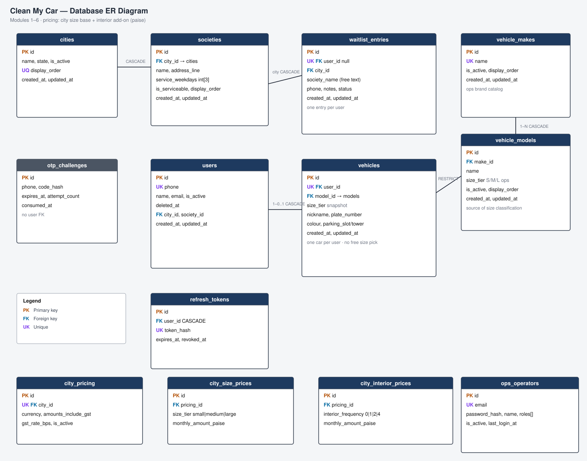

# Database ER diagram

Visual ER diagram in the style of a **pgAdmin / Workbench export** (table boxes + FK lines).

## Diagram

**File:** [`docs/diagrams/database-er.svg`](./diagrams/database-er.svg)

- Open the SVG in a browser, Preview, or VS Code to zoom/export (e.g. export PNG from the viewer if needed).
- Gray header on `otp_challenges` = no FK to `users` (OTP can run before signup).

## Maintenance rule (mandatory)

**Update `docs/diagrams/database-er.svg` whenever the database design changes** (same PR as models + Alembic):

- Add/remove/rename tables or columns
- Change FKs, nullability, uniqueness, or `ON DELETE`

Also refresh the short notes below if relationships change.

## Current tables

| Table | Role |
|-------|------|
| `cities` | Active service cities |
| `societies` | Live apartment societies + 3 service weekdays |
| `users` | Accounts; optional `city_id` / `society_id` |
| `refresh_tokens` | Hashed refresh sessions |
| `otp_challenges` | Phone OTP challenges (no user FK) |

## Relationships

| FK | Parent | Child | ON DELETE |
|----|--------|-------|-----------|
| `societies.city_id` | `cities` | `societies` | CASCADE |
| `users.city_id` | `cities` | `users` | SET NULL |
| `users.society_id` | `societies` | `users` | SET NULL |
| `refresh_tokens.user_id` | `users` | `refresh_tokens` | CASCADE |

## Alembic map

| Revision | Summary |
|----------|---------|
| `20260731_0001` | users, otp_challenges, refresh_tokens |
| `20260801_0002` | users.deleted_at |
| `20260801_0003` | cities, societies, user location FKs |
